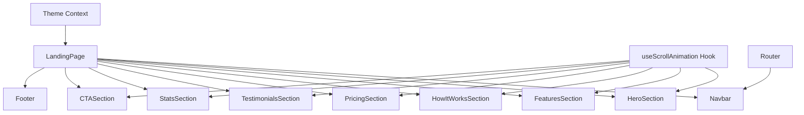

# Design Document: Landing Page Redesign

## Overview

This design document outlines the architecture and implementation approach for a comprehensive, modern landing page for the Organizational Grievance Support System (OGSS). The landing page will be built using React with existing project dependencies (Tailwind CSS, shadcn/ui components, Lucide icons) and will feature smooth animations, responsive design, and a conversion-optimized layout.

The design follows a component-based architecture with reusable sections, implements scroll-triggered animations using Intersection Observer API, and maintains consistency with the existing application's design system.

## Architecture

### Component Structure

```
frontend/src/components/page/landing/
├── LandingPage.jsx          # Main container component
├── sections/
│   ├── Navbar.jsx           # Fixed navigation with mobile menu
│   ├── HeroSection.jsx      # Hero with animated visuals
│   ├── FeaturesSection.jsx  # Feature showcase grid
│   ├── HowItWorksSection.jsx # Step-by-step workflow
│   ├── PricingSection.jsx   # Pricing tiers with toggle
│   ├── TestimonialsSection.jsx # Customer testimonials
│   ├── StatsSection.jsx     # Animated statistics
│   ├── CTASection.jsx       # Final call-to-action
│   └── Footer.jsx           # Comprehensive footer
├── components/
│   ├── FeatureCard.jsx      # Individual feature display
│   ├── PricingCard.jsx      # Pricing tier card
│   ├── TestimonialCard.jsx  # Testimonial display
│   ├── StatCard.jsx         # Animated stat counter
│   └── AnimatedSection.jsx  # Scroll-triggered animation wrapper
└── hooks/
    └── useScrollAnimation.js # Custom hook for scroll animations
```

### Data Flow



## Components and Interfaces

### 1. LandingPage Component

The main container that orchestrates all sections and manages scroll behavior.

```jsx
interface LandingPageProps {
  // No props - self-contained component
}

// Sections rendered in order with smooth scroll targets
const sections = [
  { id: 'hero', component: HeroSection },
  { id: 'features', component: FeaturesSection },
  { id: 'how-it-works', component: HowItWorksSection },
  { id: 'pricing', component: PricingSection },
  { id: 'testimonials', component: TestimonialsSection },
  { id: 'stats', component: StatsSection },
  { id: 'cta', component: CTASection },
];
```

### 2. Navbar Component

Fixed navigation with scroll-aware styling and mobile responsiveness.

```jsx
interface NavbarProps {
  // No props - uses internal state for mobile menu
}

interface NavLink {
  label: string;
  href: string; // Section ID for smooth scroll
}

const navLinks: NavLink[] = [
  { label: 'Features', href: '#features' },
  { label: 'Pricing', href: '#pricing' },
  { label: 'About', href: '#about' },
];
```

### 3. HeroSection Component

Primary conversion section with animated visuals.

```jsx
interface HeroSectionProps {
  // No props - content is static
}

// Hero content structure
const heroContent = {
  headline: "Streamline Your Organization's Workflow",
  subheadline: "Project management, grievance handling, and team collaboration - all in one powerful platform",
  primaryCTA: { label: "Start Free Trial", href: "/register" },
  secondaryCTA: { label: "Watch Demo", href: "#demo" },
  trustIndicator: "Trusted by 500+ organizations worldwide"
};
```

### 4. FeaturesSection Component

Grid display of platform capabilities.

```jsx
interface Feature {
  icon: LucideIcon;
  title: string;
  description: string;
  highlight?: string; // Optional badge text
}

const features: Feature[] = [
  {
    icon: FolderKanban,
    title: "Project Management",
    description: "Kanban boards with drag-and-drop, custom columns, and real-time updates",
    highlight: "Popular"
  },
  {
    icon: MessageSquareWarning,
    title: "Grievance Tracking",
    description: "Report, track, and resolve workplace issues with full transparency"
  },
  {
    icon: Shield,
    title: "Role-Based Permissions",
    description: "Granular access control with special permissions for flexibility"
  },
  {
    icon: Users,
    title: "Real-Time Collaboration",
    description: "Live updates via WebSocket for instant team synchronization"
  },
  {
    icon: Building,
    title: "Department Management",
    description: "Organize your workforce with departments and hierarchies"
  },
  {
    icon: Paperclip,
    title: "Task Attachments",
    description: "Attach files, images, and videos to tasks and grievances"
  }
];
```

### 5. PricingSection Component

Pricing tiers with billing toggle.

```jsx
interface PricingTier {
  name: string;
  description: string;
  monthlyPrice: number | null; // null for "Contact Sales"
  annualPrice: number | null;
  features: string[];
  highlighted: boolean;
  ctaLabel: string;
  ctaHref: string;
}

const pricingTiers: PricingTier[] = [
  {
    name: "Starter",
    description: "Perfect for small teams getting started",
    monthlyPrice: 0,
    annualPrice: 0,
    features: [
      "Up to 10 users",
      "3 active projects",
      "Basic grievance tracking",
      "Email support",
      "1GB storage"
    ],
    highlighted: false,
    ctaLabel: "Get Started Free",
    ctaHref: "/register"
  },
  {
    name: "Professional",
    description: "For growing organizations",
    monthlyPrice: 29,
    annualPrice: 290, // ~17% discount
    features: [
      "Up to 50 users",
      "Unlimited projects",
      "Advanced permissions",
      "Priority support",
      "10GB storage",
      "Custom roles",
      "Audit logs",
      "API access"
    ],
    highlighted: true,
    ctaLabel: "Start Free Trial",
    ctaHref: "/register?plan=professional"
  },
  {
    name: "Enterprise",
    description: "For large organizations",
    monthlyPrice: null,
    annualPrice: null,
    features: [
      "Unlimited users",
      "Unlimited projects",
      "SSO integration",
      "Dedicated support",
      "Unlimited storage",
      "Custom integrations",
      "SLA guarantee",
      "On-premise option"
    ],
    highlighted: false,
    ctaLabel: "Contact Sales",
    ctaHref: "/contact"
  }
];
```

### 6. TestimonialsSection Component

Customer testimonials carousel/grid.

```jsx
interface Testimonial {
  id: string;
  quote: string;
  author: string;
  role: string;
  company: string;
  avatar?: string;
  rating: number; // 1-5
}

const testimonials: Testimonial[] = [
  {
    id: "1",
    quote: "This platform transformed how we handle employee grievances. Resolution time dropped by 60%.",
    author: "Sarah Johnson",
    role: "HR Director",
    company: "TechCorp Inc.",
    rating: 5
  },
  {
    id: "2",
    quote: "The Kanban boards are incredibly intuitive. Our project delivery improved significantly.",
    author: "Michael Chen",
    role: "Project Manager",
    company: "InnovateLabs",
    rating: 5
  },
  {
    id: "3",
    quote: "Role-based permissions gave us the flexibility we needed without compromising security.",
    author: "Emily Rodriguez",
    role: "IT Manager",
    company: "GlobalServices Ltd.",
    rating: 5
  }
];
```

### 7. StatsSection Component

Animated statistics display.

```jsx
interface Stat {
  value: number;
  suffix?: string; // e.g., "+", "%", "K"
  label: string;
}

const stats: Stat[] = [
  { value: 500, suffix: "+", label: "Organizations" },
  { value: 50, suffix: "K+", label: "Tasks Completed" },
  { value: 10, suffix: "K+", label: "Grievances Resolved" },
  { value: 98, suffix: "%", label: "User Satisfaction" }
];
```

### 8. useScrollAnimation Hook

Custom hook for scroll-triggered animations.

```jsx
interface UseScrollAnimationOptions {
  threshold?: number; // 0-1, default 0.1
  triggerOnce?: boolean; // default true
  rootMargin?: string; // default "0px"
}

interface UseScrollAnimationReturn {
  ref: RefObject<HTMLElement>;
  isVisible: boolean;
  hasAnimated: boolean;
}

function useScrollAnimation(options?: UseScrollAnimationOptions): UseScrollAnimationReturn;
```

## Data Models

### Navigation State

```typescript
interface NavState {
  isScrolled: boolean;      // True when page is scrolled
  isMobileMenuOpen: boolean; // Mobile menu toggle
  activeSection: string;     // Currently visible section
}
```

### Pricing State

```typescript
interface PricingState {
  billingPeriod: 'monthly' | 'annual';
}
```

### Animation State

```typescript
interface AnimationState {
  visibleSections: Set<string>; // Sections that have animated in
}
```

## Correctness Properties

*A property is a characteristic or behavior that should hold true across all valid executions of a system-essentially, a formal statement about what the system should do. Properties serve as the bridge between human-readable specifications and machine-verifiable correctness guarantees.*

Based on the acceptance criteria analysis, the following properties can be verified through testing:

### Property 1: Navigation scroll behavior consistency

*For any* scroll position greater than 0, the Navigation_Bar should have the scrolled styling applied (background blur, shadow).

**Validates: Requirements 1.4**

### Property 2: Smooth scroll navigation

*For any* navigation link click, the page should scroll to the corresponding section with the matching ID.

**Validates: Requirements 1.6**

### Property 3: Pricing calculation consistency

*For any* pricing tier with non-null prices, the annual price should be less than or equal to (monthly price × 12), representing a discount.

**Validates: Requirements 5.6**

### Property 4: Feature card data completeness

*For any* feature displayed in the Feature_Section, it must have a non-empty title, description, and valid icon component.

**Validates: Requirements 3.1, 3.2**

### Property 5: Testimonial data completeness

*For any* testimonial displayed, it must have a non-empty quote, author name, role, company, and rating between 1-5.

**Validates: Requirements 6.1, 6.2, 6.3**

### Property 6: Statistics counter animation

*For any* statistic displayed, when the section becomes visible, the counter should animate from 0 to the target value.

**Validates: Requirements 7.3**

### Property 7: Responsive breakpoint consistency

*For any* viewport width, the layout should match the expected configuration (mobile menu visible below 768px, grid columns adjust appropriately).

**Validates: Requirements 10.1**

### Property 8: Animation performance

*For any* scroll-triggered animation, the animation should complete without dropping below 60fps (no jank).

**Validates: Requirements 10.4**

### Property 9: Accessibility keyboard navigation

*For any* interactive element (buttons, links), it should be focusable and activatable via keyboard.

**Validates: Requirements 11.2**

### Property 10: Reduced motion preference

*For any* user with prefers-reduced-motion enabled, animations should be disabled or minimized.

**Validates: Requirements 11.5**

## Error Handling

### Network Errors
- Images should have fallback placeholders
- External resources should not block page rendering

### Animation Errors
- Intersection Observer should have fallback for unsupported browsers
- Animation failures should not break page functionality

### Navigation Errors
- Invalid section IDs should be handled gracefully
- Scroll behavior should work without JavaScript (anchor links)

## Testing Strategy

### Unit Tests
- Test individual component rendering
- Test data validation for features, pricing, testimonials
- Test hook behavior (useScrollAnimation)
- Test responsive breakpoint logic

### Property-Based Tests
- Test pricing calculation invariants
- Test data completeness across all content arrays
- Test animation state transitions

### Integration Tests
- Test smooth scroll navigation
- Test mobile menu toggle behavior
- Test pricing toggle state changes

### Visual Regression Tests
- Capture screenshots at different breakpoints
- Compare animation states

### Accessibility Tests
- Automated WCAG compliance checking
- Keyboard navigation testing
- Screen reader compatibility

### Performance Tests
- Lighthouse performance audit
- Animation frame rate monitoring
- Initial load time measurement
