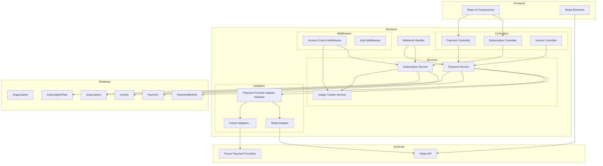

# Design Document: Subscription & Payment System

## Overview

This design document outlines the architecture and implementation details for a comprehensive subscription and payment system for the Employee Management System. The system enables organizations to subscribe to pricing tiers, process payments through multiple providers (starting with Stripe), enforce feature access restrictions, and track usage metrics.

The architecture follows a provider-agnostic approach using the Adapter pattern, allowing seamless integration of additional payment providers (Razorpay, PayPal, etc.) without modifying core business logic. The system integrates with the existing MongoDB database and Express.js backend.

## Architecture



## Components and Interfaces

### 1. Payment Provider Adapter Interface

The adapter interface defines a contract that all payment providers must implement:

```javascript
/**
 * PaymentProviderAdapter - Abstract interface for payment providers
 * All payment provider implementations must conform to this interface
 */
class PaymentProviderAdapter {
  /**
   * Create a customer in the payment provider's system
   * @param {Object} customerData - { email, name, organizationId, metadata }
   * @returns {Promise<{ customerId: string, providerData: Object }>}
   */
  async createCustomer(customerData) { throw new Error('Not implemented'); }

  /**
   * Create a payment intent for one-time or subscription payment
   * @param {Object} paymentData - { amount, currency, customerId, metadata }
   * @returns {Promise<{ paymentIntentId: string, clientSecret: string, status: string }>}
   */
  async createPaymentIntent(paymentData) { throw new Error('Not implemented'); }

  /**
   * Confirm a payment intent
   * @param {string} paymentIntentId
   * @returns {Promise<{ status: string, paidAt: Date, providerData: Object }>}
   */
  async confirmPayment(paymentIntentId) { throw new Error('Not implemented'); }

  /**
   * Create a subscription for recurring billing
   * @param {Object} subscriptionData - { customerId, priceId, trialDays, metadata }
   * @returns {Promise<{ subscriptionId: string, status: string, currentPeriodEnd: Date }>}
   */
  async createSubscription(subscriptionData) { throw new Error('Not implemented'); }

  /**
   * Update an existing subscription (upgrade/downgrade)
   * @param {string} subscriptionId
   * @param {Object} updateData - { priceId, prorationBehavior }
   * @returns {Promise<{ subscriptionId: string, status: string, currentPeriodEnd: Date }>}
   */
  async updateSubscription(subscriptionId, updateData) { throw new Error('Not implemented'); }

  /**
   * Cancel a subscription
   * @param {string} subscriptionId
   * @param {Object} options - { cancelAtPeriodEnd: boolean }
   * @returns {Promise<{ status: string, cancelAt: Date }>}
   */
  async cancelSubscription(subscriptionId, options) { throw new Error('Not implemented'); }

  /**
   * Process a refund
   * @param {string} paymentId
   * @param {Object} refundData - { amount, reason }
   * @returns {Promise<{ refundId: string, status: string, amount: number }>}
   */
  async refund(paymentId, refundData) { throw new Error('Not implemented'); }

  /**
   * Attach a payment method to a customer
   * @param {string} customerId
   * @param {string} paymentMethodId
   * @returns {Promise<{ paymentMethodId: string, type: string, last4: string }>}
   */
  async attachPaymentMethod(customerId, paymentMethodId) { throw new Error('Not implemented'); }

  /**
   * Detach a payment method from a customer
   * @param {string} paymentMethodId
   * @returns {Promise<{ success: boolean }>}
   */
  async detachPaymentMethod(paymentMethodId) { throw new Error('Not implemented'); }

  /**
   * List payment methods for a customer
   * @param {string} customerId
   * @returns {Promise<Array<{ id: string, type: string, last4: string, expiryMonth: number, expiryYear: number }>>}
   */
  async listPaymentMethods(customerId) { throw new Error('Not implemented'); }

  /**
   * Verify webhook signature
   * @param {string} payload
   * @param {string} signature
   * @returns {Object} - Parsed webhook event
   */
  verifyWebhookSignature(payload, signature) { throw new Error('Not implemented'); }

  /**
   * Get provider name
   * @returns {string}
   */
  getProviderName() { throw new Error('Not implemented'); }
}
```

### 2. Stripe Adapter Implementation

```javascript
/**
 * StripeAdapter - Stripe-specific implementation of PaymentProviderAdapter
 */
class StripeAdapter extends PaymentProviderAdapter {
  constructor(config) {
    super();
    this.stripe = require('stripe')(config.secretKey);
    this.webhookSecret = config.webhookSecret;
  }

  getProviderName() {
    return 'stripe';
  }

  async createCustomer(customerData) {
    const customer = await this.stripe.customers.create({
      email: customerData.email,
      name: customerData.name,
      metadata: {
        organizationId: customerData.organizationId,
        ...customerData.metadata
      }
    });
    return {
      customerId: customer.id,
      providerData: customer
    };
  }

  async createPaymentIntent(paymentData) {
    const paymentIntent = await this.stripe.paymentIntents.create({
      amount: paymentData.amount, // in cents
      currency: paymentData.currency || 'usd',
      customer: paymentData.customerId,
      metadata: paymentData.metadata,
      automatic_payment_methods: { enabled: true }
    });
    return {
      paymentIntentId: paymentIntent.id,
      clientSecret: paymentIntent.client_secret,
      status: this._normalizeStatus(paymentIntent.status)
    };
  }

  async createSubscription(subscriptionData) {
    const subscription = await this.stripe.subscriptions.create({
      customer: subscriptionData.customerId,
      items: [{ price: subscriptionData.priceId }],
      trial_period_days: subscriptionData.trialDays || 0,
      payment_behavior: 'default_incomplete',
      expand: ['latest_invoice.payment_intent'],
      metadata: subscriptionData.metadata
    });
    return {
      subscriptionId: subscription.id,
      status: this._normalizeSubscriptionStatus(subscription.status),
      currentPeriodEnd: new Date(subscription.current_period_end * 1000),
      clientSecret: subscription.latest_invoice?.payment_intent?.client_secret
    };
  }

  // ... additional methods

  _normalizeStatus(stripeStatus) {
    const statusMap = {
      'requires_payment_method': 'pending',
      'requires_confirmation': 'pending',
      'requires_action': 'requires_action',
      'processing': 'processing',
      'succeeded': 'succeeded',
      'canceled': 'cancelled'
    };
    return statusMap[stripeStatus] || stripeStatus;
  }

  _normalizeSubscriptionStatus(stripeStatus) {
    const statusMap = {
      'trialing': 'trialing',
      'active': 'active',
      'past_due': 'past_due',
      'canceled': 'cancelled',
      'unpaid': 'past_due',
      'incomplete': 'pending',
      'incomplete_expired': 'expired'
    };
    return statusMap[stripeStatus] || stripeStatus;
  }
}
```

### 3. Payment Service

```javascript
/**
 * PaymentService - Core service for payment operations
 * Uses adapter pattern to support multiple payment providers
 */
class PaymentService {
  constructor() {
    this.adapters = new Map();
    this._initializeAdapters();
  }

  _initializeAdapters() {
    // Load configured payment providers
    if (process.env.STRIPE_SECRET_KEY) {
      this.adapters.set('stripe', new StripeAdapter({
        secretKey: process.env.STRIPE_SECRET_KEY,
        webhookSecret: process.env.STRIPE_WEBHOOK_SECRET
      }));
    }
    // Future: Add more adapters here
    // if (process.env.RAZORPAY_KEY_ID) {
    //   this.adapters.set('razorpay', new RazorpayAdapter({...}));
    // }
  }

  getAdapter(providerName) {
    const adapter = this.adapters.get(providerName);
    if (!adapter) {
      throw new Error(`Payment provider '${providerName}' not configured`);
    }
    return adapter;
  }

  getAvailableProviders() {
    return Array.from(this.adapters.keys());
  }

  async processPayment(organizationId, providerName, paymentData) {
    const adapter = this.getAdapter(providerName);
    // ... implementation
  }
}
```

### 4. Subscription Service

```javascript
/**
 * SubscriptionService - Manages subscription lifecycle
 */
class SubscriptionService {
  async createSubscription(organizationId, planId, billingCycle, paymentMethodId) {
    // 1. Validate plan exists and is active
    // 2. Check if organization already has active subscription
    // 3. Create subscription record
    // 4. If paid plan, initiate payment via PaymentService
    // 5. Return subscription details
  }

  async upgradeSubscription(organizationId, newPlanId) {
    // 1. Get current subscription
    // 2. Calculate proration
    // 3. Update subscription with payment provider
    // 4. Update local subscription record
  }

  async downgradeSubscription(organizationId, newPlanId) {
    // 1. Get current subscription
    // 2. Schedule downgrade for end of billing period
    // 3. Update subscription record with pending change
  }

  async cancelSubscription(organizationId, immediate = false) {
    // 1. Get current subscription
    // 2. Cancel with payment provider
    // 3. Update subscription status
    // 4. If immediate, revoke access; else set cancelAtPeriodEnd
  }

  async checkSubscriptionStatus(organizationId) {
    // Returns current subscription with plan details and usage
  }
}
```

### 5. Access Control Middleware

```javascript
/**
 * AccessControlMiddleware - Enforces subscription-based access restrictions
 */
const checkSubscriptionLimit = (limitType) => {
  return async (req, res, next) => {
    const organizationId = req.user.organization_id;
    
    // Get cached subscription or fetch from DB
    const subscription = await subscriptionCache.get(organizationId) 
      || await SubscriptionService.getActiveSubscription(organizationId);
    
    if (!subscription || subscription.status === 'expired') {
      return res.status(403).json({
        error: 'Subscription required',
        code: 'SUBSCRIPTION_REQUIRED',
        upgradeUrl: '/settings/subscription'
      });
    }

    const plan = subscription.plan;
    const usage = await UsageTracker.getUsage(organizationId);

    switch (limitType) {
      case 'users':
        if (plan.limits.maxUsers !== -1 && usage.userCount >= plan.limits.maxUsers) {
          return res.status(403).json({
            error: 'User limit reached',
            code: 'USER_LIMIT_REACHED',
            currentUsage: usage.userCount,
            limit: plan.limits.maxUsers,
            upgradeUrl: '/settings/subscription'
          });
        }
        break;
      case 'projects':
        if (plan.limits.maxProjects !== -1 && usage.projectCount >= plan.limits.maxProjects) {
          return res.status(403).json({
            error: 'Project limit reached',
            code: 'PROJECT_LIMIT_REACHED',
            currentUsage: usage.projectCount,
            limit: plan.limits.maxProjects,
            upgradeUrl: '/settings/subscription'
          });
        }
        break;
      case 'storage':
        if (plan.limits.maxStorageBytes !== -1 && usage.storageBytes >= plan.limits.maxStorageBytes) {
          return res.status(403).json({
            error: 'Storage limit reached',
            code: 'STORAGE_LIMIT_REACHED',
            currentUsage: usage.storageBytes,
            limit: plan.limits.maxStorageBytes,
            upgradeUrl: '/settings/subscription'
          });
        }
        break;
      case 'feature':
        const feature = req.requiredFeature;
        if (!plan.features.includes(feature)) {
          return res.status(403).json({
            error: `Feature '${feature}' not available in your plan`,
            code: 'FEATURE_NOT_AVAILABLE',
            requiredPlan: getMinimumPlanForFeature(feature),
            upgradeUrl: '/settings/subscription'
          });
        }
        break;
    }

    next();
  };
};

// Feature check middleware
const requireFeature = (featureName) => {
  return (req, res, next) => {
    req.requiredFeature = featureName;
    return checkSubscriptionLimit('feature')(req, res, next);
  };
};
```

### 6. Usage Tracker Service

```javascript
/**
 * UsageTracker - Tracks and monitors organization resource usage
 */
class UsageTracker {
  static async getUsage(organizationId) {
    const [userCount, projectCount, storageBytes] = await Promise.all([
      User.countDocuments({ organization_id: organizationId, is_deleted: false }),
      Project.countDocuments({ organization_id: organizationId, deleted_at: null }),
      this._calculateStorageUsage(organizationId)
    ]);

    return { userCount, projectCount, storageBytes };
  }

  static async _calculateStorageUsage(organizationId) {
    const result = await Attachment.aggregate([
      { $match: { organization_id: organizationId } },
      { $group: { _id: null, totalBytes: { $sum: '$size' } } }
    ]);
    return result[0]?.totalBytes || 0;
  }

  static async checkAndNotify(organizationId) {
    const subscription = await Subscription.findOne({ 
      organization_id: organizationId, 
      status: 'active' 
    }).populate('plan_id');
    
    const usage = await this.getUsage(organizationId);
    const plan = subscription.plan_id;

    // Check each limit and send notifications
    const notifications = [];
    
    if (plan.limits.maxUsers !== -1) {
      const percentage = (usage.userCount / plan.limits.maxUsers) * 100;
      if (percentage >= 100) {
        notifications.push({ type: 'user_limit_reached', percentage: 100 });
      } else if (percentage >= 80) {
        notifications.push({ type: 'user_limit_warning', percentage });
      }
    }
    // Similar checks for projects and storage...

    return notifications;
  }
}
```

## Data Models

### SubscriptionPlan Model

```javascript
const SubscriptionPlanSchema = new mongoose.Schema({
  name: {
    type: String,
    required: true,
    enum: ['starter', 'professional', 'enterprise'],
    unique: true
  },
  displayName: {
    type: String,
    required: true
  },
  description: {
    type: String,
    required: true
  },
  monthlyPrice: {
    type: Number,
    required: true,
    default: 0
  },
  annualPrice: {
    type: Number,
    required: true,
    default: 0
  },
  currency: {
    type: String,
    default: 'usd'
  },
  limits: {
    maxUsers: { type: Number, default: -1 },      // -1 = unlimited
    maxProjects: { type: Number, default: -1 },
    maxStorageBytes: { type: Number, default: -1 }
  },
  features: [{
    type: String,
    enum: [
      'basic_grievance',
      'advanced_permissions',
      'custom_roles',
      'audit_logs',
      'api_access',
      'sso',
      'custom_integrations',
      'priority_support',
      'dedicated_support',
      'sla_guarantee',
      'on_premise'
    ]
  }],
  stripePriceIdMonthly: String,
  stripePriceIdAnnual: String,
  isActive: {
    type: Boolean,
    default: true
  },
  sortOrder: {
    type: Number,
    default: 0
  }
}, { timestamps: true });
```

### Subscription Model

```javascript
const SubscriptionSchema = new mongoose.Schema({
  organization_id: {
    type: mongoose.Schema.Types.ObjectId,
    ref: 'Organization',
    required: true,
    unique: true
  },
  plan_id: {
    type: mongoose.Schema.Types.ObjectId,
    ref: 'SubscriptionPlan',
    required: true
  },
  status: {
    type: String,
    enum: ['active', 'trialing', 'past_due', 'cancelled', 'expired', 'pending'],
    default: 'active'
  },
  billingCycle: {
    type: String,
    enum: ['monthly', 'annual'],
    default: 'monthly'
  },
  currentPeriodStart: {
    type: Date,
    required: true
  },
  currentPeriodEnd: {
    type: Date,
    required: true
  },
  cancelAtPeriodEnd: {
    type: Boolean,
    default: false
  },
  cancelledAt: Date,
  trialStart: Date,
  trialEnd: Date,
  // Provider-specific data (flexible for multiple providers)
  providerData: {
    provider: {
      type: String,
      enum: ['stripe', 'razorpay', 'paypal', 'manual']
    },
    customerId: String,
    subscriptionId: String,
    metadata: mongoose.Schema.Types.Mixed
  },
  // Pending plan change (for downgrades)
  pendingPlanChange: {
    newPlanId: mongoose.Schema.Types.ObjectId,
    effectiveDate: Date
  }
}, { timestamps: true });

SubscriptionSchema.index({ organization_id: 1 });
SubscriptionSchema.index({ status: 1 });
SubscriptionSchema.index({ currentPeriodEnd: 1 });
```

### PaymentMethod Model

```javascript
const PaymentMethodSchema = new mongoose.Schema({
  organization_id: {
    type: mongoose.Schema.Types.ObjectId,
    ref: 'Organization',
    required: true
  },
  provider: {
    type: String,
    required: true,
    enum: ['stripe', 'razorpay', 'paypal']
  },
  providerPaymentMethodId: {
    type: String,
    required: true
  },
  type: {
    type: String,
    required: true,
    enum: ['card', 'bank_transfer', 'upi', 'wallet']
  },
  // Card-specific fields
  card: {
    brand: String,      // visa, mastercard, etc.
    last4: String,
    expiryMonth: Number,
    expiryYear: Number
  },
  // Bank-specific fields (for future use)
  bank: {
    bankName: String,
    last4: String
  },
  isDefault: {
    type: Boolean,
    default: false
  },
  isActive: {
    type: Boolean,
    default: true
  }
}, { timestamps: true });

PaymentMethodSchema.index({ organization_id: 1 });
PaymentMethodSchema.index({ organization_id: 1, isDefault: 1 });
```

### Payment Model

```javascript
const PaymentSchema = new mongoose.Schema({
  organization_id: {
    type: mongoose.Schema.Types.ObjectId,
    ref: 'Organization',
    required: true
  },
  subscription_id: {
    type: mongoose.Schema.Types.ObjectId,
    ref: 'Subscription'
  },
  provider: {
    type: String,
    required: true,
    enum: ['stripe', 'razorpay', 'paypal', 'manual']
  },
  providerPaymentId: {
    type: String,
    required: true
  },
  amount: {
    type: Number,
    required: true
  },
  currency: {
    type: String,
    default: 'usd'
  },
  status: {
    type: String,
    enum: ['pending', 'processing', 'succeeded', 'failed', 'refunded', 'partially_refunded'],
    default: 'pending'
  },
  paymentMethod: {
    type: mongoose.Schema.Types.ObjectId,
    ref: 'PaymentMethod'
  },
  paidAt: Date,
  failureReason: String,
  refundedAmount: {
    type: Number,
    default: 0
  },
  metadata: mongoose.Schema.Types.Mixed
}, { timestamps: true });

PaymentSchema.index({ organization_id: 1 });
PaymentSchema.index({ providerPaymentId: 1 });
PaymentSchema.index({ status: 1 });
```

### Invoice Model

```javascript
const InvoiceSchema = new mongoose.Schema({
  organization_id: {
    type: mongoose.Schema.Types.ObjectId,
    ref: 'Organization',
    required: true
  },
  subscription_id: {
    type: mongoose.Schema.Types.ObjectId,
    ref: 'Subscription'
  },
  payment_id: {
    type: mongoose.Schema.Types.ObjectId,
    ref: 'Payment'
  },
  invoiceNumber: {
    type: String,
    required: true,
    unique: true
  },
  status: {
    type: String,
    enum: ['draft', 'pending', 'paid', 'failed', 'refunded', 'void'],
    default: 'draft'
  },
  amount: {
    type: Number,
    required: true
  },
  currency: {
    type: String,
    default: 'usd'
  },
  lineItems: [{
    description: String,
    quantity: Number,
    unitPrice: Number,
    amount: Number
  }],
  billingPeriod: {
    start: Date,
    end: Date
  },
  dueDate: Date,
  paidAt: Date,
  invoicePdfUrl: String,
  // Provider-specific invoice data
  providerData: {
    provider: String,
    invoiceId: String,
    hostedInvoiceUrl: String
  }
}, { timestamps: true });

InvoiceSchema.index({ organization_id: 1 });
InvoiceSchema.index({ invoiceNumber: 1 });
InvoiceSchema.index({ status: 1 });
```

### Organization Model Update

Add subscription reference to existing Organization model:

```javascript
// Add to OrganizationSchema
{
  subscription: {
    type: mongoose.Schema.Types.ObjectId,
    ref: 'Subscription'
  },
  stripeCustomerId: String,  // For quick lookup
  billingEmail: String       // Separate billing contact
}
```


## Correctness Properties

*A property is a characteristic or behavior that should hold true across all valid executions of a system—essentially, a formal statement about what the system should do. Properties serve as the bridge between human-readable specifications and machine-verifiable correctness guarantees.*

Based on the acceptance criteria analysis, the following correctness properties must be validated through property-based testing:

### Property 1: Plan Data Round-Trip Consistency

*For any* valid subscription plan data (name, description, prices, limits, features), storing the plan and then retrieving it SHALL produce an equivalent plan object with all fields preserved.

**Validates: Requirements 1.2**

### Property 2: New Organization Default Plan Assignment

*For any* newly created organization, the organization SHALL automatically have an active subscription to the Starter plan with status 'active' and appropriate period dates.

**Validates: Requirements 1.4**

### Property 3: Annual Pricing Discount Calculation

*For any* subscription plan with monthlyPrice > 0, the annualPrice SHALL be less than or equal to (monthlyPrice * 12 * 0.83), ensuring at least a 17% discount.

**Validates: Requirements 1.5**

### Property 4: Subscription Creation Field Completeness

*For any* subscription creation request with valid plan and billing cycle, the resulting subscription record SHALL contain: organization_id, plan_id, status, billingCycle, currentPeriodStart, and currentPeriodEnd with valid values.

**Validates: Requirements 2.1**

### Property 5: Proration Calculation Correctness

*For any* subscription upgrade from plan A to plan B mid-billing-cycle, the proration amount SHALL equal: (daysRemaining / totalDays) * (planB.price - planA.price), where the result is non-negative.

**Validates: Requirements 2.2**

### Property 6: Downgrade Scheduling at Period End

*For any* subscription downgrade request, the subscription's pendingPlanChange.effectiveDate SHALL equal the currentPeriodEnd date, and the current plan SHALL remain active until that date.

**Validates: Requirements 2.3**

### Property 7: Cancelled Subscription Access Preservation

*For any* cancelled subscription with cancelAtPeriodEnd=true, the subscription status SHALL remain 'active' and access SHALL be maintained until currentPeriodEnd is reached.

**Validates: Requirements 2.4**

### Property 8: Subscription Status Validity

*For any* subscription record in the database, the status field SHALL be one of: 'active', 'trialing', 'past_due', 'cancelled', 'expired', 'pending'.

**Validates: Requirements 2.5**

### Property 9: Trial Period Duration

*For any* new Professional subscription with trial enabled, the trialEnd date SHALL be exactly 14 days after trialStart, and status SHALL be 'trialing' during this period.

**Validates: Requirements 2.7**

### Property 10: Payment Adapter Loading

*For any* configured payment provider name, calling getAdapter(providerName) SHALL return an adapter instance that implements all required PaymentProviderAdapter methods.

**Validates: Requirements 3.2, 3.4**

### Property 11: Adapter Response Normalization

*For any* payment operation response from any configured provider, the normalized response SHALL contain consistent fields (status, amount, currency) regardless of the underlying provider's response format.

**Validates: Requirements 3.5, 3.6**

### Property 12: Limit Enforcement

*For any* organization with an active subscription, attempting to create a resource (user, project, or upload) that would exceed the plan's limit SHALL result in a 403 response with error code indicating the specific limit reached.

**Validates: Requirements 6.1, 6.2, 6.3, 6.6**

### Property 13: Feature Access Enforcement

*For any* organization attempting to access a feature (audit_logs, api_access, sso, etc.) not included in their subscription plan's features array, the request SHALL be rejected with a 403 response indicating the feature is not available.

**Validates: Requirements 6.4, 6.5**

### Property 14: Expired Subscription Read-Only Mode

*For any* organization with subscription status 'expired' or 'cancelled' (past period end), write operations (create, update, delete) SHALL be rejected while read operations SHALL succeed.

**Validates: Requirements 6.7**

### Property 15: Usage Tracking Accuracy

*For any* organization, the usage statistics returned by UsageTracker.getUsage() SHALL exactly match: userCount = count of non-deleted users, projectCount = count of non-deleted projects, storageBytes = sum of all attachment sizes.

**Validates: Requirements 7.1, 7.2, 7.3**

### Property 16: Usage Notification Thresholds

*For any* organization whose usage crosses 80% or 100% of a plan limit, the appropriate notification (warning at 80%, alert at 100%) SHALL be triggered exactly once per threshold crossing.

**Validates: Requirements 7.4, 7.5**

### Property 17: Invoice Generation Completeness

*For any* processed payment, the generated invoice SHALL contain: organization_id, invoiceNumber (unique), amount, currency, status, and at least one lineItem.

**Validates: Requirements 8.1**

### Property 18: Invoice Line Items Sum Invariant

*For any* invoice, the sum of all lineItems[].amount SHALL equal the invoice.amount field.

**Validates: Requirements 8.2**

### Property 19: Payment Method Default Uniqueness

*For any* organization with payment methods, exactly zero or one payment method SHALL have isDefault=true at any given time.

**Validates: Requirements 5.3**

## Error Handling

### Payment Errors

```javascript
class PaymentError extends Error {
  constructor(code, message, providerError = null) {
    super(message);
    this.name = 'PaymentError';
    this.code = code;
    this.providerError = providerError;
  }
}

const PaymentErrorCodes = {
  CARD_DECLINED: 'card_declined',
  INSUFFICIENT_FUNDS: 'insufficient_funds',
  EXPIRED_CARD: 'expired_card',
  INVALID_CARD: 'invalid_card',
  PROCESSING_ERROR: 'processing_error',
  PROVIDER_UNAVAILABLE: 'provider_unavailable',
  INVALID_AMOUNT: 'invalid_amount',
  DUPLICATE_TRANSACTION: 'duplicate_transaction'
};
```

### Subscription Errors

```javascript
class SubscriptionError extends Error {
  constructor(code, message, details = {}) {
    super(message);
    this.name = 'SubscriptionError';
    this.code = code;
    this.details = details;
  }
}

const SubscriptionErrorCodes = {
  PLAN_NOT_FOUND: 'plan_not_found',
  ALREADY_SUBSCRIBED: 'already_subscribed',
  INVALID_UPGRADE: 'invalid_upgrade',
  INVALID_DOWNGRADE: 'invalid_downgrade',
  SUBSCRIPTION_NOT_FOUND: 'subscription_not_found',
  ALREADY_CANCELLED: 'already_cancelled',
  PAYMENT_REQUIRED: 'payment_required'
};
```

### Access Control Errors

```javascript
class AccessError extends Error {
  constructor(code, message, upgradeInfo = {}) {
    super(message);
    this.name = 'AccessError';
    this.code = code;
    this.upgradeInfo = upgradeInfo;
  }
}

const AccessErrorCodes = {
  SUBSCRIPTION_REQUIRED: 'subscription_required',
  USER_LIMIT_REACHED: 'user_limit_reached',
  PROJECT_LIMIT_REACHED: 'project_limit_reached',
  STORAGE_LIMIT_REACHED: 'storage_limit_reached',
  FEATURE_NOT_AVAILABLE: 'feature_not_available',
  SUBSCRIPTION_EXPIRED: 'subscription_expired',
  READ_ONLY_MODE: 'read_only_mode'
};
```

### Webhook Error Handling

```javascript
const handleWebhookError = async (event, error) => {
  // Log error for debugging
  console.error(`Webhook processing failed for event ${event.id}:`, error);
  
  // Store failed event for retry
  await FailedWebhook.create({
    eventId: event.id,
    eventType: event.type,
    payload: event,
    error: error.message,
    retryCount: 0,
    nextRetryAt: new Date(Date.now() + 5 * 60 * 1000) // 5 minutes
  });
  
  // Return 200 to prevent Stripe from retrying (we handle retries ourselves)
  return { received: true, processed: false };
};
```

## Testing Strategy

### Property-Based Testing Configuration

The system will use **fast-check** as the property-based testing library for JavaScript/Node.js.

```javascript
const fc = require('fast-check');

// Configuration for property tests
const propertyTestConfig = {
  numRuns: 100,           // Minimum 100 iterations per property
  verbose: true,
  seed: Date.now()        // For reproducibility
};
```

### Test Organization

Tests are organized into two categories:

1. **Unit Tests**: Specific examples, edge cases, and error conditions
2. **Property Tests**: Universal properties that must hold for all valid inputs

### Property Test Examples

```javascript
// Property 2: New Organization Default Plan Assignment
describe('Subscription Service', () => {
  it('Property 2: New organizations get Starter plan', async () => {
    // Feature: subscription-payment-system, Property 2: New Organization Default Plan Assignment
    // Validates: Requirements 1.4
    await fc.assert(
      fc.asyncProperty(
        fc.record({
          name: fc.string({ minLength: 1, maxLength: 100 }),
          email: fc.emailAddress(),
          address: fc.string({ minLength: 1 })
        }),
        async (orgData) => {
          const org = await Organization.create(orgData);
          const subscription = await Subscription.findOne({ organization_id: org._id });
          
          expect(subscription).toBeDefined();
          expect(subscription.status).toBe('active');
          
          const plan = await SubscriptionPlan.findById(subscription.plan_id);
          expect(plan.name).toBe('starter');
        }
      ),
      propertyTestConfig
    );
  });

  // Property 12: Limit Enforcement
  it('Property 12: Limit enforcement blocks resource creation at limit', async () => {
    // Feature: subscription-payment-system, Property 12: Limit Enforcement
    // Validates: Requirements 6.1, 6.2, 6.3, 6.6
    await fc.assert(
      fc.asyncProperty(
        fc.constantFrom('users', 'projects', 'storage'),
        fc.integer({ min: 1, max: 100 }),
        async (limitType, limitValue) => {
          // Setup: Create org with plan at exact limit
          const org = await setupOrgAtLimit(limitType, limitValue);
          
          // Act: Try to create one more resource
          const result = await attemptResourceCreation(org._id, limitType);
          
          // Assert: Should be rejected with 403
          expect(result.status).toBe(403);
          expect(result.body.code).toContain('LIMIT_REACHED');
        }
      ),
      propertyTestConfig
    );
  });
});
```

### Unit Test Examples

```javascript
describe('Subscription Service - Unit Tests', () => {
  describe('Plan Configuration', () => {
    it('should have exactly 3 plans configured', async () => {
      const plans = await SubscriptionPlan.find({ isActive: true });
      expect(plans).toHaveLength(3);
      expect(plans.map(p => p.name).sort()).toEqual(['enterprise', 'professional', 'starter']);
    });

    it('Starter plan should have correct limits', async () => {
      const starter = await SubscriptionPlan.findOne({ name: 'starter' });
      expect(starter.limits.maxUsers).toBe(10);
      expect(starter.limits.maxProjects).toBe(3);
      expect(starter.limits.maxStorageBytes).toBe(1 * 1024 * 1024 * 1024); // 1GB
    });
  });

  describe('Edge Cases', () => {
    it('should handle concurrent subscription updates', async () => {
      // Test race condition handling
    });

    it('should handle webhook replay attacks', async () => {
      // Test idempotency
    });
  });
});
```

### Test File Structure

```
backend/__tests__/
├── unit/
│   ├── subscription.service.test.js
│   ├── payment.service.test.js
│   ├── usage-tracker.test.js
│   └── access-control.middleware.test.js
├── property/
│   ├── subscription.property.test.js
│   ├── payment.property.test.js
│   ├── access-control.property.test.js
│   └── usage-tracker.property.test.js
└── integration/
    ├── stripe-webhook.test.js
    └── subscription-lifecycle.test.js
```

### Test Data Generators

```javascript
// Custom generators for property tests
const generators = {
  subscriptionPlan: () => fc.record({
    name: fc.constantFrom('starter', 'professional', 'enterprise'),
    monthlyPrice: fc.integer({ min: 0, max: 1000 }),
    limits: fc.record({
      maxUsers: fc.oneof(fc.constant(-1), fc.integer({ min: 1, max: 1000 })),
      maxProjects: fc.oneof(fc.constant(-1), fc.integer({ min: 1, max: 100 })),
      maxStorageBytes: fc.oneof(fc.constant(-1), fc.integer({ min: 1, max: 100 * 1024 * 1024 * 1024 }))
    })
  }),

  organization: () => fc.record({
    name: fc.string({ minLength: 1, maxLength: 100 }),
    email: fc.emailAddress(),
    address: fc.string({ minLength: 1, maxLength: 200 })
  }),

  billingCycle: () => fc.constantFrom('monthly', 'annual'),
  
  subscriptionStatus: () => fc.constantFrom('active', 'trialing', 'past_due', 'cancelled', 'expired', 'pending')
};
```

